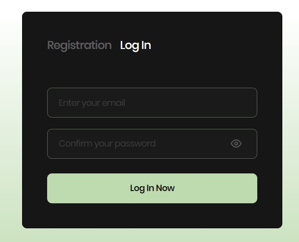
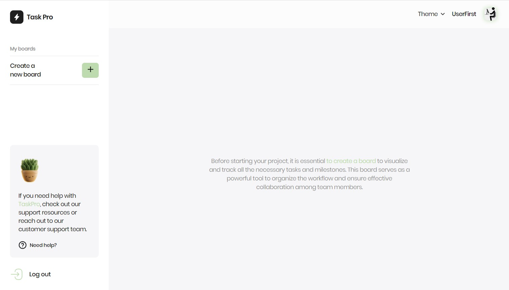
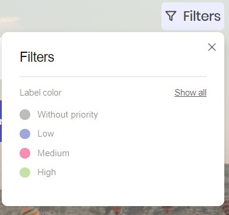
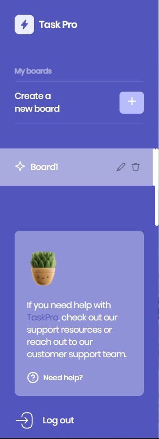
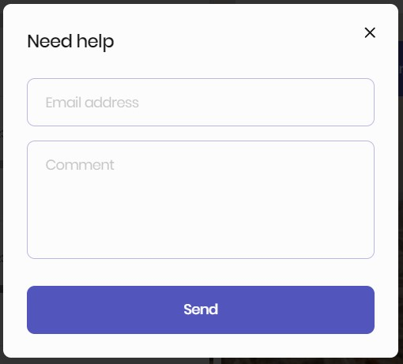

# Project "Task-Manager"

This project is a web application built with React and a custom backend that implements the following functionality and requirements:

## Team

| Frontend                  | Backend                   |
|---------------------------|---------------------------|
| [Yevheniia Melnychenko](https://github.com/MelnychenkoJenny) - Team Lead | [Zakhar Tsarapov](https://github.com/ZakharTsarapov) - Team Lead |
| [Olga Bahrii](https://github.com/OIgaB) - Developer | [Olga Tikhonchik](https://github.com/OlgaTikhonchik) - Developer |
| [Karina Khaliullina](https://github.com/Karinkarllina) - Developer | [Olena Hachkovska](https://github.com/HelenGachkovska) - Developer |
| [Dmytro Nahirniak](https://github.com/TyllerDurden97) - Developer | [Kostiantyn Koshyk](https://github.com/K-Basket) - Developer |
| [Iryna Neher](https://github.com/iratsaruk13) - Developer | |
| [Kostiantyn Koshyk](https://github.com/K-Basket) - Developer | |
| [Oleksandr Fisun](https://github.com/AleksandrFisun) - Developer | |
| [Maxym Peshkov](https://github.com/soulsword1) - Developer | |
| [Oleksandr Afanasyev](https://github.com/stoletoff) - Developer | |
| [Artem Osipov](https://github.com/ArtemOsypov) - Developer | |

## Prerequisites

Before running the project, make sure you have all the necessary dependencies installed on your computer.

- Node.js (version 18.9.1)
- npm (or yarn)

## Installation

1. Clone this repository to your computer:

    ```bash
    git clone https://github.com/MelnychenkoJenny/Task-Manager.git
    ```

2. Navigate to the project directory:

    ```bash
    cd your_project
    ```

3. Install dependencies:

    ```bash
    npm install
    ```

4. Start the project with the following command:

    ```bash
    npm start
    ```

## General Information

- Custom backend [API source](https://taskpro-backend-jo75.onrender.com/api-docs/) and [GitHub](https://github.com/ZakharTsarapov/taskpro-backend)
- Responsive design.
- Fonts are loaded using `font-face`.
- Optimization of vector and raster graphics.
- Support for displaying images on retina screens.
- Image loading optimization.
- All icons are connected through a sprite.
- Form validation.

## WelcomePage

- Displayed when the application is opened.
- Contains buttons to navigate to the AuthPage (Registration and LogIn).


## AuthPage

- A dynamic route that can be "/auth/login" or "/auth/register".
- Consists of the LoginForm and RegisterForm components.
- Form fields are validated using `yup` and `formik`.




## HomePage

- Consists of the Header, Sidebar, and ScreensPage components.





### Header

The component consists of:

- A select element that allows changing the theme of the application (choose from three themes: Light, Violet, Dark).
- UserInfo component with user's personal information, including a photo and user's name.




### Sidebar

- A component that contains navigation for boards and the ability to create new boards.
- A block where you can request help.
- Logout button.





### ScreensPage

This is a dynamically changing board depending on the selected board (boardName is taken from the URL).

The board contains:
- A Header (HeaderDashboard) with the board's name and buttons for filtering and changing the background.
- The main content of the board (MainDashboard) with the ability to create and edit columns and cards.

## MainDashboard

The main content of the board, which can contain:

- An "Add Column" button to create a new column.
- Each column can be edited or deleted.
- Each column contains a list of cards with the ability to create, edit, and move them.
- Cards have a title, description, priority, and deadline.
- Horizontal and vertical scrolling is implemented in case the screen size is exceeded.


