# Проєкт "Task-Manager"

Цей проєкт представляє собою веб-додаток на React з кастомним Бек-ендом, який реалізує такі
функціональність і вимоги:

## Команда


| Фронтенд                   | Бекенд                    |
|----------------------------|---------------------------|
| [Євгенія Мельниченко](https://github.com/MelnychenkoJenny) - Тімлід | [Захар Царапов](https://github.com/ZakharTsarapov) - Тімлід |
| [Ольга Багрій](https://github.com/OIgaB) - Розробник | [Ольга Тихончик](https://github.com/OlgaTikhonchik) - Розробник |
| [Карина Халіулліна](https://github.com/Karinkarllina) - Розробник | [Олена Гачковська](https://github.com/HelenGachkovska) - Розробник |
| [Дмитро Нагірняк](https://github.com/TyllerDurden97) - Розробник | [Костянтин Кошик](https://github.com/K-Basket) - Розробник |
| [Ірина Негер](https://github.com/iratsaruk13) - Розробник | |
| [Костянтин Кошик](https://github.com/K-Basket) - Розробник | |
| [Олександр Фісун](https://github.com/AleksandrFisun) - Розробник | |
| [Максим Пєшков](https://github.com/soulsword1) - Розробник | |
| [Олександр Афанасьєв](https://github.com/stoletoff) - Розробник | |
| [Артем Осипов](https://github.com/ArtemOsypov) - Розробник | |


## Передумови

Перед запуском проєкту переконайтеся, що на вашому комп'ютері встановлені всі
необхідні залежності.

- Node.js (версія 18.9.1)
- npm (або yarn)

## Встановлення

1. Спочатку склонуйте цей репозиторій на свій комп'ютер:

    ```bash
    git clone https://github.com/MelnychenkoJenny/Task-Manager.git
    ```

2. Перейдіть до каталогу проекту:

    ```bash
    cd ваш_проект
    ```

3. Встановіть залежності:

    ```bash
    npm install
    ```

4. Запустіть проект за допомогою наступної команди:

    ```bash
    npm start
    ```

## Загальна інформація

- Кастомний бекенд [API джерело](https://taskpro-backend-jo75.onrender.com/api-docs/) та [GitHub](https://github.com/ZakharTsarapov/taskpro-backend)
- Верстка гумова.
- Підключення шрифтів за допомогою `font-face`.
- Оптимізація розмірів векторної та растрової графіки.
- Підтримка відображення картинок для retina-екранів.
- Оптимізація завантаження зображень.
- Всі іконки підключені через спрайт.
- Валідація форм.


## WelcomePage

- Відображається при відкритті додатка.
- Містить кнопки для переходу на AuthPage (Registration та LogIn).

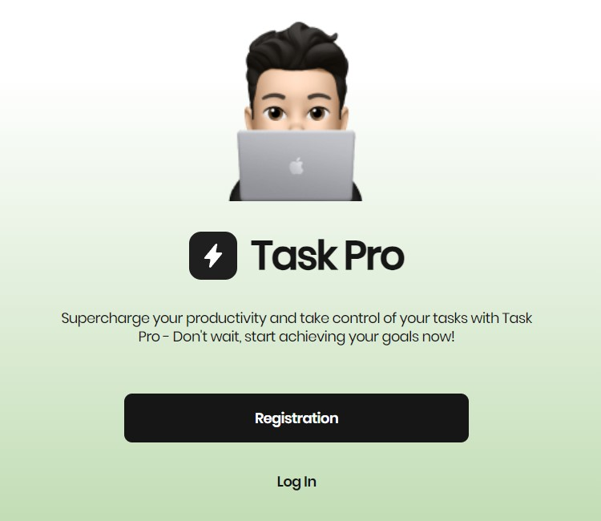


## AuthPage

- Динамічний роут, який може бути "/auth/login" або "/auth/register".
- Складається з компонентів LoginForm та RegisterForm.
- Поля в формах провалідовані використовуючи `yup` та `formik`.

<div style="display: flex; gap: 20px; margin-bottom: 20px;">
  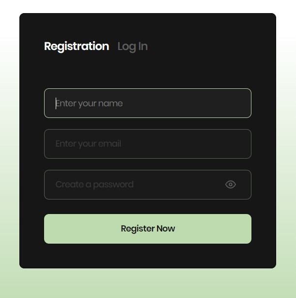
  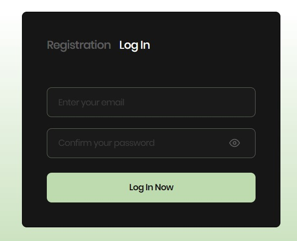
</div>

## HomePage

- Складається з компонентів Header, Sidebar, та ScreensPage.
<div style="display: flex; gap: 20px; margin-bottom: 20px">
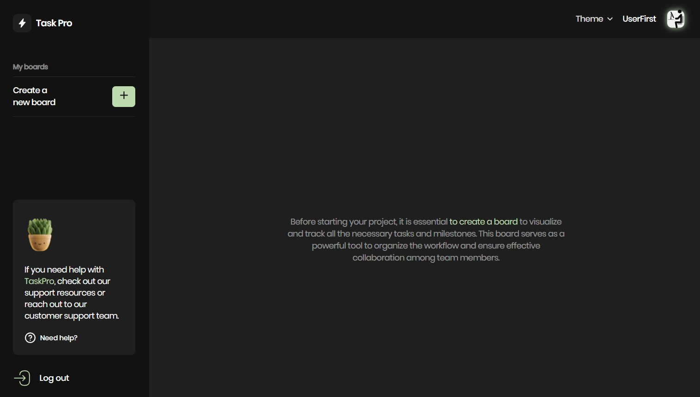
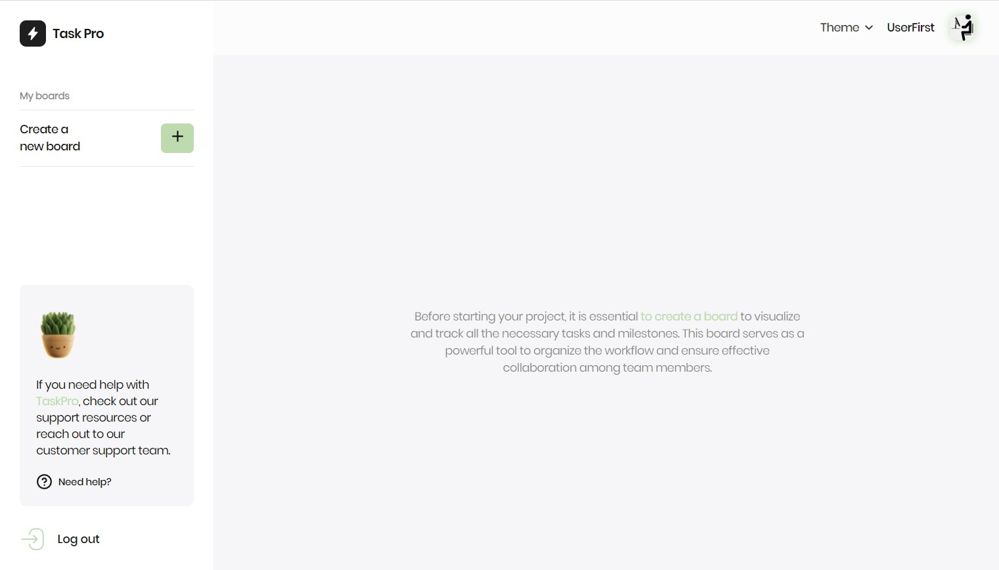
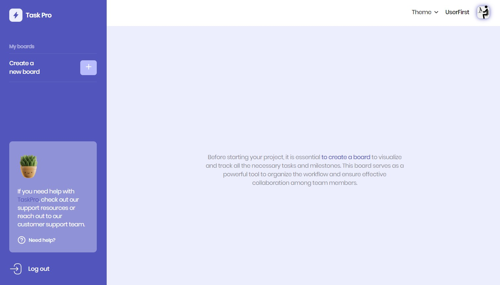
</div>

### Header

Компонент складається з:

- селекту за допомогою якого можна змінювати тему в застосунку. (на вибір три теми Light, Violet, Dark).
- Компонент UserInfo з особистою інформацією про юзера. Складається з Фото та ім'я юзера. 

<div style="display: flex; gap: 15px; margin-bottom: 20px">
  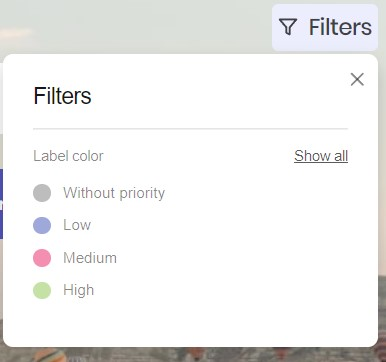
  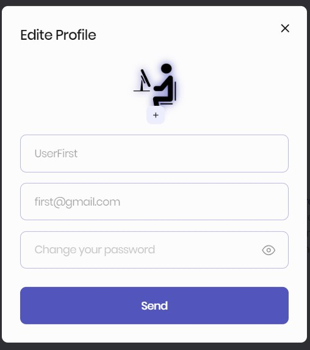
</div>


### Sidebar

- Компонент, що містить навігацію по дошкам та можливість створення нових дошок.
- Блок де можна запросити допомогу.
- Кнопка Logout.

<div style="display: flex; gap: 15px; margin-bottom: 20px">
  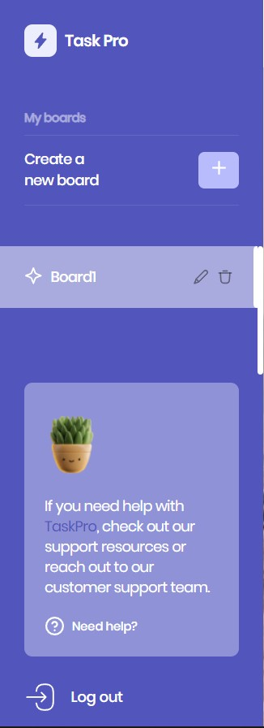
  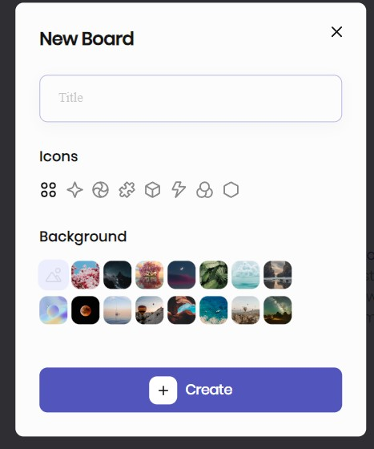
  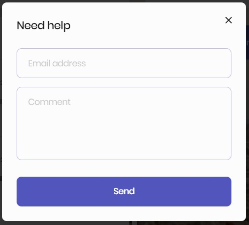
</div>


### ScreensPage

Це дошка, яка змінюється динамічно в залежності від вибраної дошки (boardName
береться з URL).

Дошка містить:
- Шапку (HeaderDashboard) з назвою дошки та кнопкою для фільтрації та зміни фону.
- Основний контент дошки (MainDashboard) з можливістю створення та редагування колонок та карток.

## MainDashboard

Основний контент дошки, який може містити:

- Кнопку "Add Column" для створення нової колонки.
- Кожну колонку можна редагувати або видаляти.
- Кожна колонка містить список карток з можливістю створення, редагування та
  переміщення.
- Картки мають заголовок, опис, пріоритет та дедлайн.
- Реалізовано горизонтальний та вертикальний скролл у випадку перевищення розмірів екрану.

<div style="display: flex; gap: 15px; margin-bottom: 20px">
  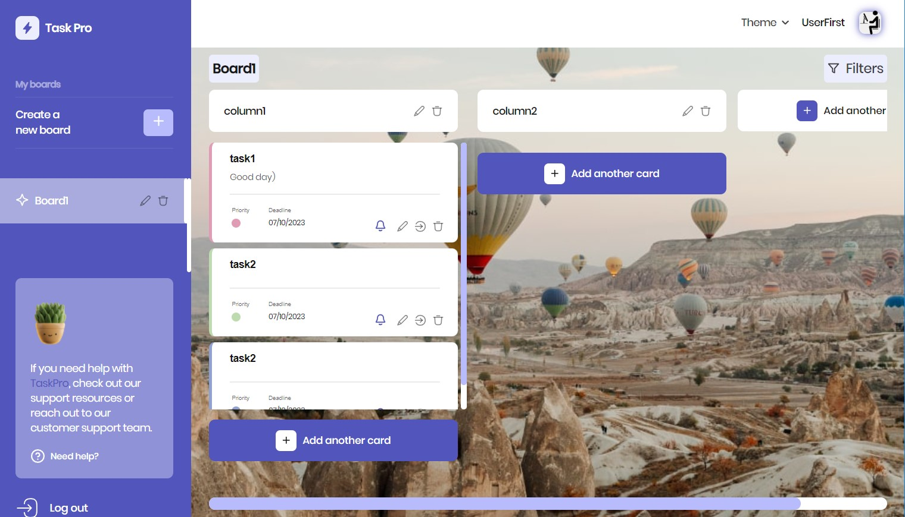
  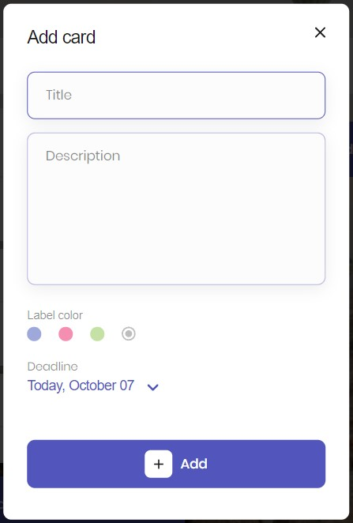
  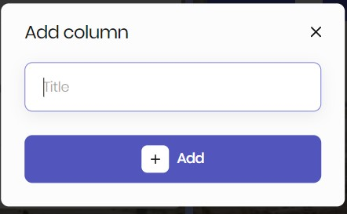
</div>


